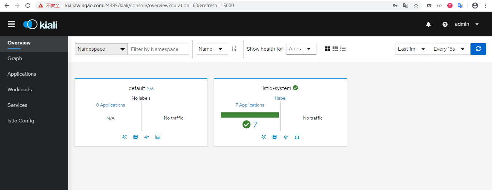
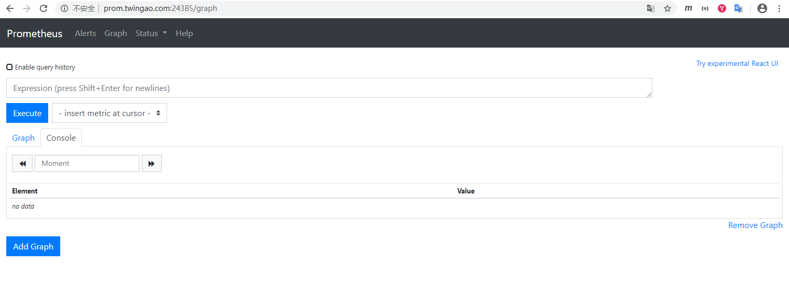
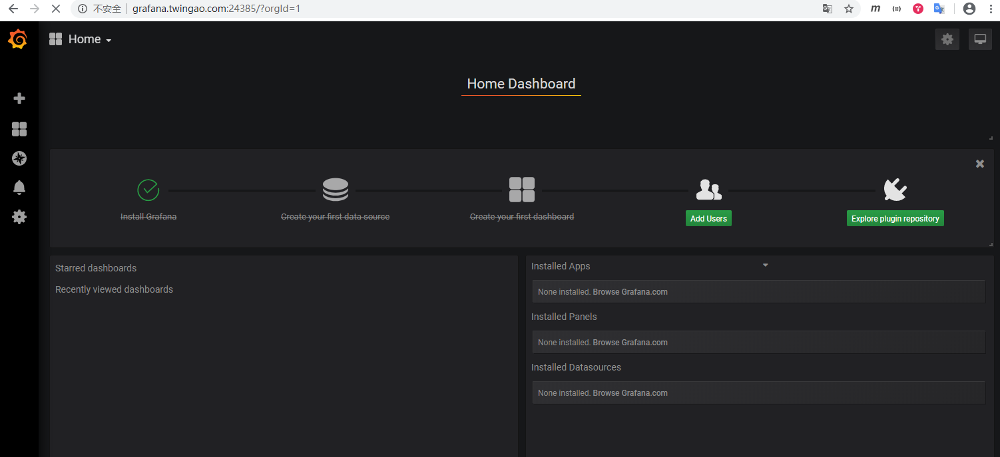
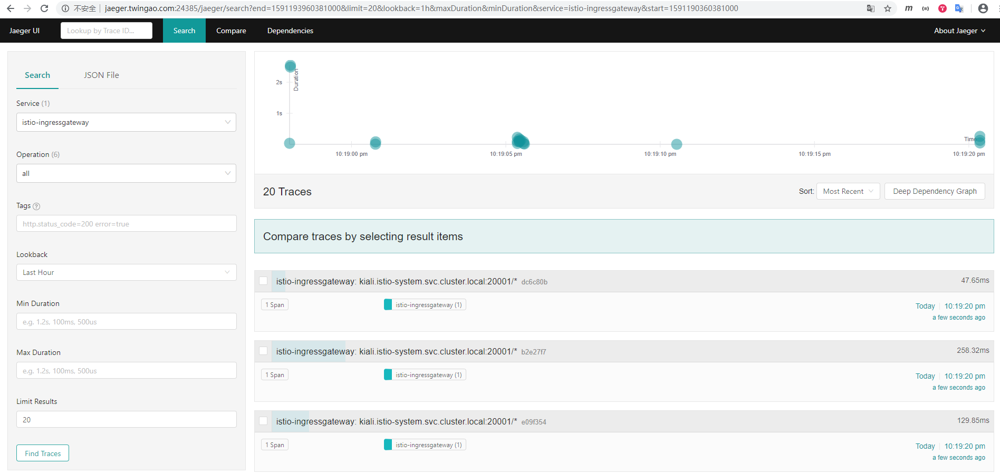

# Istio 1.7.1 安装

下载[https://github.com/istio/istio/releases/download/1.7.1/istio-1.7.1-linux-amd64.tar.gz](https://github.com/istio/istio/releases/download/1.7.1/istio-1.7.1-linux-amd64.tar.gz)。

解压istio，并将istioctl拷贝到系统路径下。

    tar zxvf istio-1.7.1-linux-amd64.tar.gz
    cp istio-1.7.1/bin/istioctl /usr/local/bin/

版本号。

    istioctl version
    client version: 1.6.0
    control plane version: 1.6.0
    data plane version: 1.6.0 (3 proxies)

istio内置了多个部署配置profile，不同的配置profile应对不同的不同场景。可以使用命令行列出内置的profile列表。

    istioctl profile list
    Istio configuration profiles:
        empty
        minimal
        preview
        remote
        default
        demo

下表列出各个profile支持组件情况。

|  | default | demo | minimal | remote |
| :------| :------: | :------: | :------: | :------: |
| Core components |  |  |  |  |
| &nbsp;&nbsp;&nbsp;&nbsp;&nbsp;`istio-egressgateway` |  | X |  |  |
| &nbsp;&nbsp;&nbsp;&nbsp;&nbsp;`istio-ingressgateway` | X | X |  |  |
| &nbsp;&nbsp;&nbsp;&nbsp;&nbsp;`istio-pilot` | X | X | X |  |
| Addons |  |  |  |  |
| &nbsp;&nbsp;&nbsp;&nbsp;&nbsp;`grafana` |  | X |  |  |
| &nbsp;&nbsp;&nbsp;&nbsp;&nbsp;`istio-tracing` |  | X |  |  |
| &nbsp;&nbsp;&nbsp;&nbsp;&nbsp;`kiali` |  | X |  |  |
| &nbsp;&nbsp;&nbsp;&nbsp;&nbsp;`prometheus` | X | X |  | X |

default一般应用于生产环境，demo功能最完备，一般应用用于学习和测试环境。本文安装demo profile。

我们查看一下demo profile的配置。

    istioctl profile dump demo
    2020-06-03T13:15:04.724608Z     info    proto: tag has too few fields: "-"
    apiVersion: install.istio.io/v1alpha1
    kind: IstioOperator
    spec:
      addonComponents:
        grafana:
          enabled: true
          k8s:
            replicaCount: 1
        istiocoredns:
          enabled: false
        kiali:
          enabled: true
          k8s:
            replicaCount: 1
        prometheus:
          enabled: true
          k8s:
            replicaCount: 1
        tracing:
          enabled: true
      components:
        base:
          enabled: true
        citadel:
          enabled: false
          k8s:
            strategy:
              rollingUpdate:
                maxSurge: 100%
                maxUnavailable: 25%
        cni:
          enabled: false
        egressGateways:
        - enabled: true
          k8s:
            resources:
              requests:
                cpu: 10m
                memory: 40Mi
          name: istio-egressgateway
        ingressGateways:
        - enabled: true
          k8s:
            resources:
              requests:
                cpu: 10m
                memory: 40Mi
            service:
              ports:
              - name: status-port
                port: 15020
                targetPort: 15020
              - name: http2
                port: 80
                targetPort: 8080
              - name: https
                port: 443
                targetPort: 8443
              - name: tcp
                port: 31400
                targetPort: 31400
              - name: tls
                port: 15443
                targetPort: 15443
          name: istio-ingressgateway
        istiodRemote:
          enabled: false
        pilot:
          enabled: true
          k8s:
            env:
            - name: POD_NAME
              valueFrom:
                fieldRef:
                  apiVersion: v1
                  fieldPath: metadata.name
            - name: POD_NAMESPACE
              valueFrom:
                fieldRef:
                  apiVersion: v1
                  fieldPath: metadata.namespace
            - name: GODEBUG
              value: gctrace=1
            - name: PILOT_TRACE_SAMPLING
              value: "100"
            - name: CONFIG_NAMESPACE
              value: istio-config
            readinessProbe:
              httpGet:
                path: /ready
                port: 8080
              initialDelaySeconds: 1
              periodSeconds: 3
              timeoutSeconds: 5
            resources:
              requests:
                cpu: 10m
                memory: 100Mi
            strategy:
              rollingUpdate:
                maxSurge: 100%
                maxUnavailable: 25%
        policy:
          enabled: false
          k8s:
            env:
            - name: POD_NAMESPACE
              valueFrom:
                fieldRef:
                  apiVersion: v1
                  fieldPath: metadata.namespace
            hpaSpec:
              maxReplicas: 5
              metrics:
              - resource:
                  name: cpu
                  targetAverageUtilization: 80
                type: Resource
              minReplicas: 1
              scaleTargetRef:
                apiVersion: apps/v1
                kind: Deployment
                name: istio-policy
            resources:
              requests:
                cpu: 10m
                memory: 100Mi
            strategy:
              rollingUpdate:
                maxSurge: 100%
                maxUnavailable: 25%
        telemetry:
          enabled: false
          k8s:
            env:
            - name: POD_NAMESPACE
              valueFrom:
                fieldRef:
                  apiVersion: v1
                  fieldPath: metadata.namespace
            - name: GOMAXPROCS
              value: "6"
            hpaSpec:
              maxReplicas: 5
              metrics:
              - resource:
                  name: cpu
                  targetAverageUtilization: 80
                type: Resource
              minReplicas: 1
              scaleTargetRef:
                apiVersion: apps/v1
                kind: Deployment
                name: istio-telemetry
            replicaCount: 1
            resources:
              limits:
                cpu: 4800m
                memory: 4G
              requests:
                cpu: 50m
                memory: 100Mi
            strategy:
              rollingUpdate:
                maxSurge: 100%
                maxUnavailable: 25%
      hub: docker.io/istio
      meshConfig:
        accessLogFile: /dev/stdout
        disablePolicyChecks: false
        enablePrometheusMerge: false
      profile: demo
      tag: 1.6.0
      values:
        base:
          validationURL: ""
        clusterResources: true
        gateways:
          istio-egressgateway:
            autoscaleEnabled: false
            env: {}
            name: istio-egressgateway
            secretVolumes:
            - mountPath: /etc/istio/egressgateway-certs
              name: egressgateway-certs
              secretName: istio-egressgateway-certs
            - mountPath: /etc/istio/egressgateway-ca-certs
              name: egressgateway-ca-certs
              secretName: istio-egressgateway-ca-certs
            type: ClusterIP
            zvpn: {}
          istio-ingressgateway:
            applicationPorts: ""
            autoscaleEnabled: false
            debug: info
            domain: ""
            env: {}
            meshExpansionPorts:
            - name: tcp-pilot-grpc-tls
              port: 15011
              targetPort: 15011
            - name: tcp-istiod
              port: 15012
              targetPort: 15012
            - name: tcp-citadel-grpc-tls
              port: 8060
              targetPort: 8060
            - name: tcp-dns-tls
              port: 853
              targetPort: 8853
            name: istio-ingressgateway
            secretVolumes:
            - mountPath: /etc/istio/ingressgateway-certs
              name: ingressgateway-certs
              secretName: istio-ingressgateway-certs
            - mountPath: /etc/istio/ingressgateway-ca-certs
              name: ingressgateway-ca-certs
              secretName: istio-ingressgateway-ca-certs
            type: LoadBalancer
            zvpn: {}
        global:
          arch:
            amd64: 2
            ppc64le: 2
            s390x: 2
          configValidation: true
          controlPlaneSecurityEnabled: true
          defaultNodeSelector: {}
          defaultPodDisruptionBudget:
            enabled: true
          defaultResources:
            requests:
              cpu: 10m
          enableHelmTest: false
          imagePullPolicy: ""
          imagePullSecrets: []
          istioNamespace: istio-system
          istiod:
            enableAnalysis: false
            enabled: true
          jwtPolicy: third-party-jwt
          logAsJson: false
          logging:
            level: default:info
          meshExpansion:
            enabled: false
            useILB: false
          meshNetworks: {}
          mountMtlsCerts: false
          multiCluster:
            clusterName: ""
            enabled: false
          network: ""
          omitSidecarInjectorConfigMap: false
          oneNamespace: false
          operatorManageWebhooks: false
          pilotCertProvider: istiod
          priorityClassName: ""
          proxy:
            autoInject: enabled
            clusterDomain: cluster.local
            componentLogLevel: misc:error
            enableCoreDump: false
            envoyStatsd:
              enabled: false
            excludeIPRanges: ""
            excludeInboundPorts: ""
            excludeOutboundPorts: ""
            image: proxyv2
            includeIPRanges: '*'
            logLevel: warning
            privileged: false
            readinessFailureThreshold: 30
            readinessInitialDelaySeconds: 1
            readinessPeriodSeconds: 2
            resources:
              limits:
                cpu: 2000m
                memory: 1024Mi
              requests:
                cpu: 10m
                memory: 40Mi
            statusPort: 15020
            tracer: zipkin
          proxy_init:
            image: proxyv2
            resources:
              limits:
                cpu: 100m
                memory: 50Mi
              requests:
                cpu: 10m
                memory: 10Mi
          sds:
            token:
              aud: istio-ca
          sts:
            servicePort: 0
          tracer:
            datadog:
              address: $(HOST_IP):8126
            lightstep:
              accessToken: ""
              address: ""
            stackdriver:
              debug: false
              maxNumberOfAnnotations: 200
              maxNumberOfAttributes: 200
              maxNumberOfMessageEvents: 200
            zipkin:
              address: ""
          trustDomain: cluster.local
          useMCP: false
        grafana:
          accessMode: ReadWriteMany
          contextPath: /grafana
          dashboardProviders:
            dashboardproviders.yaml:
              apiVersion: 1
              providers:
              - disableDeletion: false
                folder: istio
                name: istio
                options:
                  path: /var/lib/grafana/dashboards/istio
                orgId: 1
                type: file
          datasources:
            datasources.yaml:
              apiVersion: 1
          env: {}
          envSecrets: {}
          image:
            repository: grafana/grafana
            tag: 6.5.2
          nodeSelector: {}
          persist: false
          podAntiAffinityLabelSelector: []
          podAntiAffinityTermLabelSelector: []
          security:
            enabled: false
            passphraseKey: passphrase
            secretName: grafana
            usernameKey: username
          service:
            annotations: {}
            externalPort: 3000
            name: http
            type: ClusterIP
          storageClassName: ""
          tolerations: []
        istiocoredns:
          coreDNSImage: coredns/coredns
          coreDNSPluginImage: istio/coredns-plugin:0.2-istio-1.1
          coreDNSTag: 1.6.2
        istiodRemote:
          injectionURL: ""
        kiali:
          contextPath: /kiali
          createDemoSecret: true
          dashboard:
            auth:
              strategy: login
            grafanaInClusterURL: http://grafana:3000
            jaegerInClusterURL: http://tracing/jaeger
            passphraseKey: passphrase
            secretName: kiali
            usernameKey: username
            viewOnlyMode: false
          hub: quay.io/kiali
          nodeSelector: {}
          podAntiAffinityLabelSelector: []
          podAntiAffinityTermLabelSelector: []
          security:
            cert_file: /kiali-cert/cert-chain.pem
            enabled: false
            private_key_file: /kiali-cert/key.pem
          service:
            annotations: {}
          tag: v1.18
        mixer:
          adapters:
            kubernetesenv:
              enabled: true
            prometheus:
              enabled: true
              metricsExpiryDuration: 10m
            stackdriver:
              auth:
                apiKey: ""
                appCredentials: false
                serviceAccountPath: ""
              enabled: false
              tracer:
                enabled: false
                sampleProbability: 1
            stdio:
              enabled: true
              outputAsJson: false
            useAdapterCRDs: false
          policy:
            adapters:
              kubernetesenv:
                enabled: true
              useAdapterCRDs: false
            autoscaleEnabled: false
            image: mixer
            sessionAffinityEnabled: false
          telemetry:
            autoscaleEnabled: false
            env:
              GOMAXPROCS: "6"
            image: mixer
            loadshedding:
              latencyThreshold: 100ms
              mode: enforce
            nodeSelector: {}
            podAntiAffinityLabelSelector: []
            podAntiAffinityTermLabelSelector: []
            replicaCount: 1
            sessionAffinityEnabled: false
            tolerations: []
        pilot:
          appNamespaces: []
          autoscaleEnabled: false
          autoscaleMax: 5
          autoscaleMin: 1
          configMap: true
          configNamespace: istio-config
          cpu:
            targetAverageUtilization: 80
          enableProtocolSniffingForInbound: true
          enableProtocolSniffingForOutbound: true
          env: {}
          image: pilot
          keepaliveMaxServerConnectionAge: 30m
          nodeSelector: {}
          podAntiAffinityLabelSelector: []
          podAntiAffinityTermLabelSelector: []
          policy:
            enabled: false
          replicaCount: 1
          tolerations: []
          traceSampling: 1
        prometheus:
          contextPath: /prometheus
          hub: docker.io/prom
          nodeSelector: {}
          podAntiAffinityLabelSelector: []
          podAntiAffinityTermLabelSelector: []
          provisionPrometheusCert: true
          retention: 6h
          scrapeInterval: 15s
          security:
            enabled: true
          tag: v2.15.1
          tolerations: []
        sidecarInjectorWebhook:
          enableNamespacesByDefault: false
          injectLabel: istio-injection
          objectSelector:
            autoInject: true
            enabled: false
          rewriteAppHTTPProbe: true
        telemetry:
          enabled: true
          v1:
            enabled: false
          v2:
            enabled: true
            metadataExchange: {}
            prometheus:
              enabled: true
            stackdriver:
              configOverride: {}
              enabled: false
              logging: false
              monitoring: false
              topology: false
        tracing:
          jaeger:
            accessMode: ReadWriteMany
            hub: docker.io/jaegertracing
            memory:
              max_traces: 50000
            persist: false
            spanStorageType: badger
            storageClassName: ""
            tag: "1.16"
          nodeSelector: {}
          opencensus:
            exporters:
              stackdriver:
                enable_tracing: true
            hub: docker.io/omnition
            resources:
              limits:
                cpu: "1"
                memory: 2Gi
              requests:
                cpu: 200m
                memory: 400Mi
            tag: 0.1.9
          podAntiAffinityLabelSelector: []
          podAntiAffinityTermLabelSelector: []
          provider: jaeger
          service:
            annotations: {}
            externalPort: 9411
            name: http-query
            type: ClusterIP
          zipkin:
            hub: docker.io/openzipkin
            javaOptsHeap: 700
            maxSpans: 500000
            node:
              cpus: 2
            probeStartupDelay: 10
            queryPort: 9411
            resources:
              limits:
                cpu: 1000m
                memory: 2048Mi
              requests:
                cpu: 150m
                memory: 900Mi
            tag: 2.20.0
        version: ""

我们可以使用 istioctl 安装 istio。

    istioctl manifest apply --set profile=demo
    Detected that your cluster does not support third party JWT authentication. Falling back to less secure first party JWT. See https://istio.io/docs/ops/best-practices/security/#configure-third-party-service-account-tokens for details.
    ✔ Istio core installed
    ✔ Istiod installed
    ✔ Egress gateways installed
    ✔ Ingress gateways installed
    ✔ Addons installed
    ✔ Installation complete                                                                                                                     

> 如果也可以在该命令行中覆盖profile配置中的配置项，用法类似于helm，比如覆盖掉缺省的镜像。

    istioctl manifest apply \
      --set profile=demo \
      --set hub=docker.io/istio \
      --set values.prometheus.hub=docker.io/prom

查看Kubernetes资源。

    kubectl get all -nistio-system
    NAME                                        READY   STATUS    RESTARTS   AGE
    pod/grafana-74dc798895-jrdq2                1/1     Running   0          8m11s
    pod/istio-egressgateway-69bf865cf8-n29xq    1/1     Running   0          8m14s
    pod/istio-ingressgateway-569d44555d-f26xp   1/1     Running   0          8m13s
    pod/istio-tracing-8584b4d7f9-jmgtg          1/1     Running   0          8m11s
    pod/istiod-84cc4dfcd8-9cmm7                 1/1     Running   0          8m59s
    pod/kiali-6f457f5964-dzmxb                  1/1     Running   0          8m11s
    pod/prometheus-79878ff5fd-m5hbg             2/2     Running   0          8m11s

    NAME                                TYPE           CLUSTER-IP     EXTERNAL-IP   PORT(S)                                                                     AGE
    service/grafana                     ClusterIP      10.1.229.216   <none>        3000/TCP                                                                    8m11s
    service/istio-egressgateway         ClusterIP      10.1.30.249    <none>        80/TCP,443/TCP,15443/TCP                                                    8m13s
    service/istio-ingressgateway        LoadBalancer   10.1.206.44    <pending>     15020:15572/TCP,80:24385/TCP,443:3404/TCP,31400:13508/TCP,15443:13613/TCP   8m12s
    service/istiod                      ClusterIP      10.1.153.49    <none>        15010/TCP,15012/TCP,443/TCP,15014/TCP,53/UDP,853/TCP                        8m58s
    service/jaeger-agent                ClusterIP      None           <none>        5775/UDP,6831/UDP,6832/UDP                                                  8m11s
    service/jaeger-collector            ClusterIP      10.1.113.20    <none>        14267/TCP,14268/TCP,14250/TCP                                               8m11s
    service/jaeger-collector-headless   ClusterIP      None           <none>        14250/TCP                                                                   8m11s
    service/jaeger-query                ClusterIP      10.1.226.37    <none>        16686/TCP                                                                   8m11s
    service/kiali                       ClusterIP      10.1.195.114   <none>        20001/TCP                                                                   8m10s
    service/prometheus                  ClusterIP      10.1.66.64     <none>        9090/TCP                                                                    8m10s
    service/tracing                     ClusterIP      10.1.224.122   <none>        80/TCP                                                                      8m10s
    service/zipkin                      ClusterIP      10.1.8.108     <none>        9411/TCP                                                                    8m10s

    NAME                                   READY   UP-TO-DATE   AVAILABLE   AGE
    deployment.apps/grafana                1/1     1            1           8m11s
    deployment.apps/istio-egressgateway    1/1     1            1           8m14s
    deployment.apps/istio-ingressgateway   1/1     1            1           8m14s
    deployment.apps/istio-tracing          1/1     1            1           8m11s
    deployment.apps/istiod                 1/1     1            1           8m59s
    deployment.apps/kiali                  1/1     1            1           8m11s
    deployment.apps/prometheus             1/1     1            1           8m11s

    NAME                                              DESIRED   CURRENT   READY   AGE
    replicaset.apps/grafana-74dc798895                1         1         1       8m12s
    replicaset.apps/istio-egressgateway-69bf865cf8    1         1         1       8m15s
    replicaset.apps/istio-ingressgateway-569d44555d   1         1         1       8m15s
    replicaset.apps/istio-tracing-8584b4d7f9          1         1         1       8m12s
    replicaset.apps/istiod-84cc4dfcd8                 1         1         1       9m
    replicaset.apps/kiali-6f457f5964                  1         1         1       8m12s
    replicaset.apps/prometheus-79878ff5fd             1         1         1       8m12s

可以看到service/istio-ingressgateway为LoadBalancer类型，为了能够在集群外访问，改为NodePort类型。

    kubectl patch service istio-ingressgateway -n istio-system -p '{"spec":{"type":"NodePort"}}'

    kubectl get service -nistio-system
    NAME                        TYPE        CLUSTER-IP     EXTERNAL-IP   PORT(S)                                                                     AGE
    grafana                     ClusterIP   10.1.229.216   <none>        3000/TCP                                                                    10m
    istio-egressgateway         ClusterIP   10.1.30.249    <none>        80/TCP,443/TCP,15443/TCP                                                    10m
    istio-ingressgateway        NodePort    10.1.206.44    <none>        15020:15572/TCP,80:24385/TCP,443:3404/TCP,31400:13508/TCP,15443:13613/TCP   10m
    istiod                      ClusterIP   10.1.153.49    <none>        15010/TCP,15012/TCP,443/TCP,15014/TCP,53/UDP,853/TCP                        10m
    jaeger-agent                ClusterIP   None           <none>        5775/UDP,6831/UDP,6832/UDP                                                  10m
    jaeger-collector            ClusterIP   10.1.113.20    <none>        14267/TCP,14268/TCP,14250/TCP                                               10m
    jaeger-collector-headless   ClusterIP   None           <none>        14250/TCP                                                                   10m
    jaeger-query                ClusterIP   10.1.226.37    <none>        16686/TCP                                                                   10m
    kiali                       ClusterIP   10.1.195.114   <none>        20001/TCP                                                                   10m
    prometheus                  ClusterIP   10.1.66.64     <none>        9090/TCP                                                                    10m
    tracing                     ClusterIP   10.1.224.122   <none>        80/TCP                                                                      10m
    zipkin                      ClusterIP   10.1.8.108     <none>        9411/TCP                                                                    10m

为了在集群外访问kiali，配置gateway和VirtualService。

    kubectl apply -f - <<EOF
    apiVersion: networking.istio.io/v1alpha3
    kind: Gateway
    metadata:
      name: kiali-gateway
      namespace: istio-system
    spec:
      selector:
        istio: ingressgateway
      servers:
      - port:
          number: 80
          name: http
          protocol: HTTP
        hosts:
        - "kiali.twingao.com"
    ---
    apiVersion: networking.istio.io/v1alpha3
    kind: VirtualService
    metadata:
      name: kiali-vs
      namespace: istio-system
    spec:
      gateways:
      - kiali-gateway
      hosts:
      - kiali.twingao.com
      http:
      - route:
        - destination:
            host: kiali
            port:
              number: 20001
    EOF
    gateway.networking.istio.io/kiali-gateway created
    virtualservice.networking.istio.io/kiali-vs created

通过curl访问。

    curl -H "Host: kiali.twingao.com" 192.168.1.55:24385
    <a href="/kiali/">Found</a>.

在C:\Windows\System32\drivers\etc\hosts中添加域名。

    192.168.1.55 kiali.twingao.com
    192.168.1.55 prom.twingao.com
    192.168.1.55 grafana.twingao.com
    192.168.1.55 jaeger.twingao.com

通过浏览器访问[http://kiali.twingao.com:24385/](http://kiali.twingao.com:24385/)，使用admin/admin登录。

为了在集群外访问Prometheus，配置gateway和VirtualService。

    kubectl apply -f - <<EOF
    apiVersion: networking.istio.io/v1alpha3
    kind: Gateway
    metadata:
      name: prometheus-gateway
      namespace: istio-system
    spec:
      selector:
        istio: ingressgateway
      servers:
      - port:
          number: 80
          name: http
          protocol: HTTP
        hosts:
        - "prom.twingao.com"
    ---
    apiVersion: networking.istio.io/v1alpha3
    kind: VirtualService
    metadata:
      name: prometheus-vs
      namespace: istio-system
    spec:
      gateways:
      - prometheus-gateway
      hosts:
      - prom.twingao.com
      http:
      - route:
        - destination:
            host: prometheus
            port:
              number: 9090
    EOF
    gateway.networking.istio.io/prometheus-gateway created
    virtualservice.networking.istio.io/prometheus-vs created

通过curl访问。

    curl -H "Host: prom.twingao.com" 192.168.1.55:24385
    <a href="/graph">Found</a>.

通过浏览器访问[http://prom.twingao.com:24385/](http://prom.twingao.com:24385/)。

为了在集群外访问Grafana，配置gateway和VirtualService。

    kubectl apply -f - <<EOF
    apiVersion: networking.istio.io/v1alpha3
    kind: Gateway
    metadata:
      name: grafana-gateway
      namespace: istio-system
    spec:
      selector:
        istio: ingressgateway
      servers:
      - port:
          number: 80
          name: http
          protocol: HTTP
        hosts:
        - "grafana.twingao.com"
    ---
    apiVersion: networking.istio.io/v1alpha3
    kind: VirtualService
    metadata:
      name: grafana-vs
      namespace: istio-system
    spec:
      gateways:
      - grafana-gateway
      hosts:
      - grafana.twingao.com
      http:
      - route:
        - destination:
            host: grafana
            port:
              number: 3000
    EOF
    gateway.networking.istio.io/grafana-gateway created
    virtualservice.networking.istio.io/grafana-vs created

通过curl访问。

    curl -H "Host: grafana.twingao.com" 192.168.1.55:24385 -s | grep "<title>.*</title>"
      <title>Grafana</title>

通过浏览器访问[http://grafana.twingao.com:24385/](http://grafana.twingao.com:24385/)。

为了在集群外访问jaeger，配置gateway和VirtualService。

    kubectl apply -f - <<EOF
    apiVersion: networking.istio.io/v1alpha3
    kind: Gateway
    metadata:
      name: jaeger-gateway
      namespace: istio-system
    spec:
      selector:
        istio: ingressgateway
      servers:
      - port:
          number: 80
          name: http
          protocol: HTTP
        hosts:
        - "jaeger.twingao.com"
    ---
    apiVersion: networking.istio.io/v1alpha3
    kind: VirtualService
    metadata:
      name: jaeger-vs
      namespace: istio-system
    spec:
      gateways:
      - jaeger-gateway
      hosts:
      - jaeger.twingao.com
      http:
      - route:
        - destination:
            host: jaeger-query
            port:
              number: 16686
    EOF
    gateway.networking.istio.io/jaeger-gateway created
    virtualservice.networking.istio.io/jaeger-vs created

通过curl访问。

    curl -H "Host: jaeger.twingao.com" 192.168.1.55:24385 -s | grep "<title>.*</title>"
    <!doctype html><html lang="en"><head><meta charset="utf-8"><meta name="viewport" content="width=device-width,initial-scale=1"><meta http-equiv="cache-control" content="max-age=0"/><meta http-equiv="cache-control" content="no-cache"/><meta http-equiv="expires" content="0"/><meta http-equiv="expires" content="Tue, 01 Jan 1980 1:00:00 GMT"/><meta http-equiv="pragma" content="no-cache"/><base href="/jaeger/" data-inject-target="BASE_URL"/><link rel="shortcut icon" href="./favicon.ico"><title>Jaeger UI</title><script>// Jaeger UI config data is embedded by the query-service. This is

通过浏览器访问[http://jaeger.twingao.com:24385/](http://jaeger.twingao.com:24385/)。

